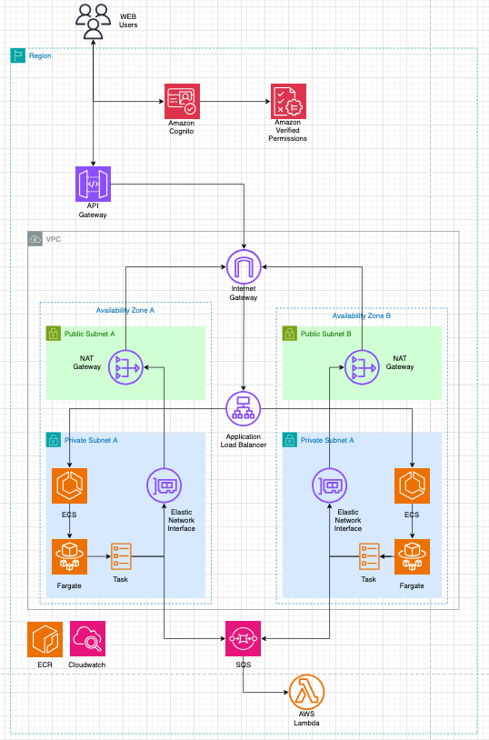

# AWS Infrastructure as Code (Terraform)

This project defines the complete AWS infrastructure using Terraform, designed to support modern cloud-native applications with scalable, secure, and asynchronous architecture.

## Objective

Provision the entire AWS environment via code, allowing applications to run inside ECS clusters using Fargate, communicating through asynchronous SQS queues, exposed via API Gateway, and secured by Cognito and Amazon Verified Permissions.

---

## Architecture Overview

  

---

## Modules Included

- `api-gateway`: Public-facing endpoint with Cognito authentication
- `cognito`: User pool and client configuration
- `dynamodb`: Creates the Person table
- `ecs`: Deploys ECS cluster and Fargate-based services
- `iam`: Creates permissions for the application
- `lb`: Load Balancer for distributing traffic across availability zones
- `sqs`: Creates application queues with Dead Letter Queues (DLQs)
- `vpc`: Creates a custom VPC with:
  - 2 Public Subnets (A & B)
  - 2 Private Subnets (A & B)
  - NAT Gateways
  - Internet Gateway
  - Route Tables
- `ecr`: Creates ECR repositories per application

---

## Features

### Compute

- **ECS Cluster with Fargate**
- **Auto-scaling ECS Services**
- **Runs inside Private Subnet**

### Networking

- **VPC with 2 Availability Zones (A & B)**
- **Public and Private Subnets**
- **NAT Gateway for private subnet internet access**
- **Elastic Network Interfaces for ECS**

### Messaging

- **Amazon SQS with Dead Letter Queues**
- **Asynchronous message processing**
- **Secure IAM-based access**

### Deployment

- **GitHub Actions for CI/CD**
- **ECR for Docker image hosting**
- **Automatic ECS deployment upon image push**

### Security

- **API Gateway protected via Amazon Cognito**
- **Access controlled via Amazon Verified Permissions**
- **Policies mapped to user groups**

### Monitoring

- **CloudWatch Logs for ECS Services**
- **Centralized metrics and dashboards**

---

## Terraform Usage

### Prerequisites

- Terraform = 1.11.2
- hashicorp/aws = 5.91.0